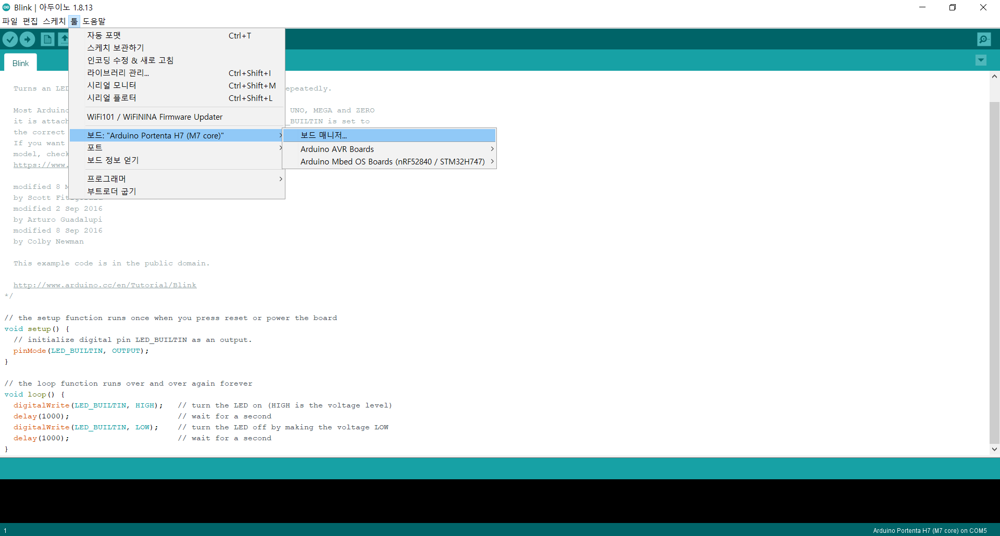
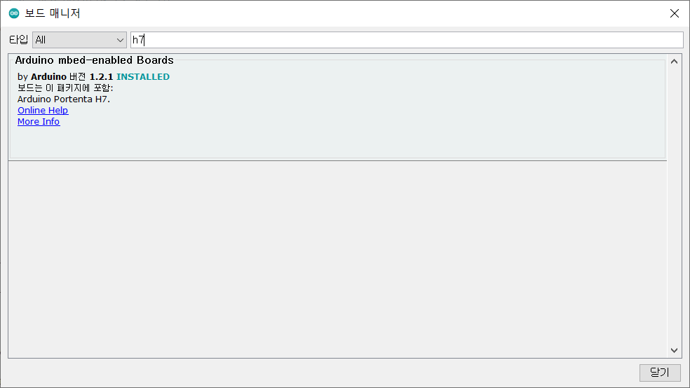
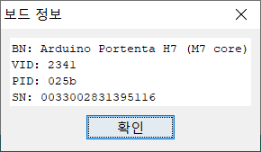
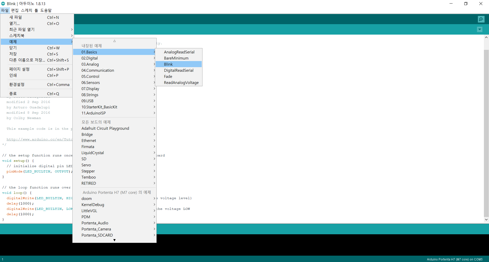
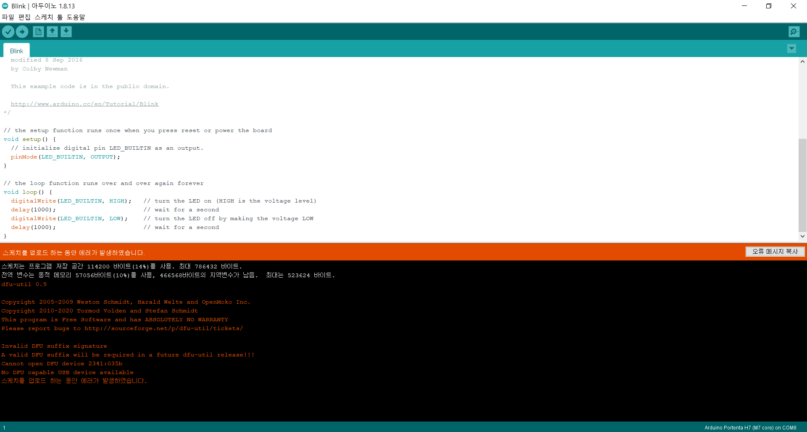
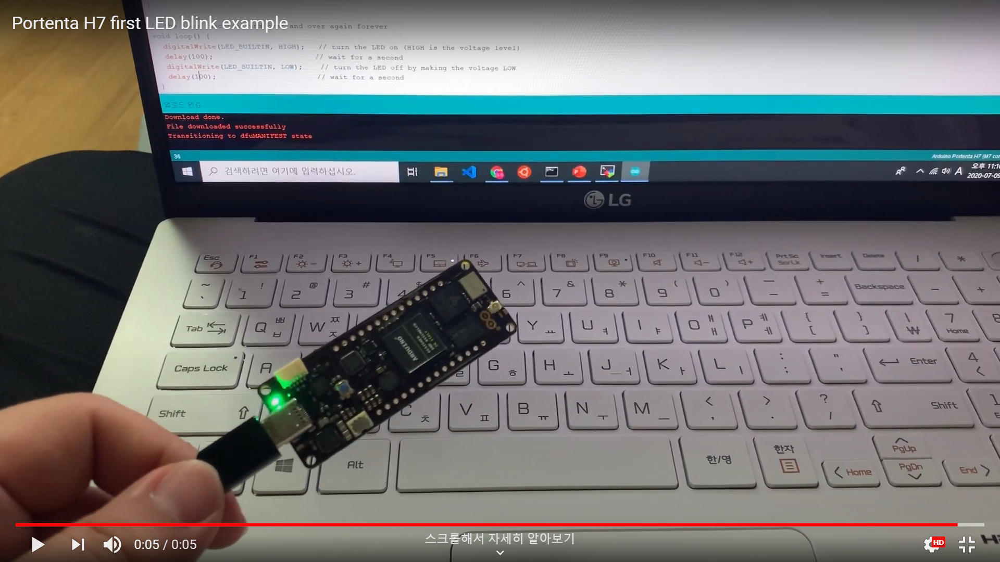

# Portenta-H7
  - Portenta-H7
  - 협찬 : ST코리아(아두이노 보드), 네이버 카페 전자공작

# 0) Setup
  - Portenta-H7(이하 "아두이노" 혹은 "H7보드") 은 Pro 라인업이고, 아두이노에서도 Arduino Pro IDE를 추천하지만 아직 beta버전이라 사용하지 않습니다. 
  - 대신 일반적인 Arduino IDE 버전 1.8.12 를 사용합니다. 
  ### 추가 SW 설치
  - 툴 -> 보드 -> 보드 매니저 항목을 선택
    - 
  - 보드 매니저 창에서 "h7"을 검색해서 나오는 항목을 설치
    -    
  - 보드 정보를 클릭하여 정상적으로 IDE가 보드를 인식했는지 확인
    -     

# 1) LED Blink
  - blink 예제를 선택
    -   
  - 업로드 버튼을 클릭하여 업로드
    - 단축키 Ctrl + U
  - 아래와 같이 DFU 에러가 발생하는 경우가 있음
    -     
  - 위 상황처럼 DFU 에러가 나는경우 아래를 따라하면 된다.
    - C:\Users\\<@사용자>\AppData\Local\Arduino15\packages\arduino-beta\hardware\mbed\1.2.0\post_install.bat 파일을 찾아서 더블클릭
    - 이후 재실행시 정상동작하는 모습 확인
      - 링크 : https://youtu.be/-6o1uQPnkMU
      - 
      
# 참고할만한 사이트
  - 목록  
    - 
    - 보드 정보 : https://store.arduino.cc/usa/portenta-h7
    - H7 : https://www.arduino.cc/pro/hardware/product/portenta-h7
    - 캐리어 : https://www.arduino.cc/pro/hardware/product/portenta-carrier
    - 아두이노 프로젝트 : https://create.arduino.cc/projecthub
    - 
    - 
